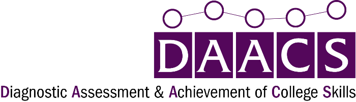

```{r setup, echo=FALSE, results='hide', message=FALSE, warning=FALSE, error=FALSE}
if(FALSE) { # For debugging
	params <- list(user = 'davidwfranklinjr@gmail.com',	config = '../config/config.R')
}

library(mongolite)
library(tidyverse)
library(psych)

source(params$config)


srl_labels <- c(
	'motivation' = 'Motivation',
	'strategies' = 'Strategies',
	'metacognition' = 'Metacognition',
	'selfefficacy' = 'Self-Efficacy',
	"anxiety" = 'Managing Test Anxiety',
	"evaluation" = 'Metacognition Evaluation',
	"help_seeking" = 'Help Seeking',
	"managing_environment" = 'Managing Environment',
	"managing_time" = 'Managing Time',
	"mastery_orientation" = 'Mastery Orientation',
	"mindset" = 'Mindset',
	"monitoring" = 'Metacognition Monitoring',
	"planning" = 'Metacognition Planning',
	"self_efficacy" = 'Self-Efficacy',
	"self_efficacy_for_mathematics" = 'Self-Efficacy for Mathematics',
	"self_efficacy_for_mathematics2" = 'Self-Efficacy for Mathematics',
	"self_efficacy_for_reading" = 'Self-Efficacy for Reading',
	"selfefficacy_for_reading" = 'Self-Efficacy for Reading',
	"self_efficacy_for_writing" = 'Self-Efficacy for Writing',
	"selfefficacy_for_writing" = 'Self-Efficacy for Writing',
	"selfefficacy_for_online_learning" = 'Self-Efficacy for Online Learning',
	"understanding" = 'Strategies for Understanding'
)

# TODO: Figure out if we can link from the ggplot2. Code below will work for 
# HTML but not PDF.
srl_links <- c(
	'motivation' = '/assessments/college_skills/domain/motivation',
	'strategies' = '/assessments/college_skills/domain/strategies',
	'metacognition' = '/assessments/college_skills/domain/metacognition',
	'selfefficacy' = '/assessments/college_skills/domain/selfefficacy',
	"anxiety" = '/assessments/college_skills/domain/motivation/subdomain/anxiety',
	"evaluation" = '/assessments/college_skills/domain/metacognition/subdomain/evaluation',
	"help_seeking" = '/assessments/college_skills/domain/strategies/subdomain/help_seeking',
	"managing_environment" = '/assessments/college_skills/domain/strategies/subdomain/managing_environment',
	"managing_time" = '/assessments/college_skills/domain/strategies/subdomain/managing_time',
	"mastery_orientation" = '/assessments/college_skills/domain/motivation/subdomain/mastery_orientation',
	"mindset" = '/assessments/college_skills/domain/motivation/subdomain/mindset',
	"monitoring" = '/assessments/college_skills/domain/metacognition/subdomain/monitoring',
	"planning" = '/assessments/college_skills/domain/metacognition/subdomain/planning',
	"self_efficacy" = '/assessments/college_skills/domain/selfefficacy',
	"self_efficacy_for_mathematics" = '/assessments/college_skills/domain/selfefficacy/subdomain/self_efficacy_for_mathematics2',
	"self_efficacy_for_mathematics2" = '/assessments/college_skills/domain/selfefficacy/subdomain/self_efficacy_for_mathematics2',
	"self_efficacy_for_reading" = '/assessments/college_skills/domain/selfefficacy/subdomain/selfefficacy_for_reading',
	"selfefficacy_for_reading" = '/assessments/college_skills/domain/selfefficacy/subdomain/selfefficacy_for_reading',
	"self_efficacy_for_writing" = '/assessments/college_skills/domain/selfefficacy/subdomain/selfefficacy_for_writing',
	"selfefficacy_for_writing" = '/assessments/college_skills/domain/selfefficacy/subdomain/selfefficacy_for_writing',
	"selfefficacy_for_online_learning" = '/assessments/college_skills/domain/selfefficacy/subdomain/selfefficacy_for_online_learning',
	"understanding" = '/assessments/college_skills/domain/strategies/subdomain/understanding'
)


srl_tips <- c(
	# 'motivation' = '',
	# 'strategies' = '',
	# 'metacognition' = '',
	'selfefficacy' = 'self_efficacy_for_online_learning.md',
	"anxiety" = 'anxiety.md',
	"help_seeking" = 'help_seeking.md',
	"managing_environment" = 'managing_environment.md',
	"managing_time" = 'managing_time.md',
	"mastery_orientation" = 'mastery_orientation.md',
	"mindset" = 'mindset.md',
	"evaluation" = 'evaluation.md',
	"monitoring" = 'monitoring.md',
	"planning" = 'planning.md',
	"self_efficacy" = 'self_efficacy_for_online_learning.md',
	"self_efficacy_for_mathematics" = 'self_efficacy_for_mathematics.md',
	"self_efficacy_for_mathematics2" = 'self_efficacy_for_mathematics.md',
	"self_efficacy_for_reading" = 'self_efficacy_for_reading.md',
	"selfefficacy_for_reading" = 'self_efficacy_for_reading.md',
	"self_efficacy_for_writing" = 'self_efficacy_for_writing.md',
	"selfefficacy_for_writing" = 'self_efficacy_for_writing.md',
	"selfefficacy_for_online_learning" = 'self_efficacy_for_online_learning.md',
	"understanding" = 'understanding.md'
)

# source('../R/local_users.R')

if(LOCAL_DB & file.exists(local.db)) {
	load(local.db)
} else {
	library(mongolite)
	URI <- paste0('mongodb://', mongo.user, ':', mongo.pass, '@',
				  mongo.host, ':', mongo.port, '/', mongo.db)
	# m.users <- mongo(url = URI, collection = mongo.collection.users)
	m.user_assessments <- mongo(url = URI, collection = mongo.collection.assessments)
	# m.events <- mongo(url = URI, collection = mongo.collection.events)
}

guide <- as.data.frame(readxl::read_excel('../resources/guide.xlsx'))
writing.rubric <- as.data.frame(readxl::read_excel('../resources/writing/rubric.xlsx'))

getUserResults <- function(username) {
	if(LOCAL_DB) {
		results <- user_assessments[user_assessments$username == username, ]
	} else {
		# fields <- c('_id', 'username', 'userId', 'assessmentId',
		# 			'assessmentType', 'assessmentCategory', 'assessmentLabel',
		# 			'takenDate', 'status', 'progressPercentage', 'completionDate',
		# 			'domainScores', 'overallScore', 'scoringType', 'writingPrompt')
		# f <- paste0("{", paste0('"', fields, '":', 1:length(fields), collapse = ', '), "}")
		# results <- m.user_assessments$find(paste0('{"username":"', username, '"}'),
		# 								   field = f)
		#
		results <- m.user_assessments$find(paste0('{"username":"', username, '"}'))
	}
	return(results)
}

getStudentResponses <- function(srl, studentRow) {
	studentdf <- data.frame(question = character(),
							domain = character(),
							answer = character(),
							score = integer(),
							stringsAsFactors = FALSE)
	tmp <- srl[studentRow,]$itemGroups[[1]]
	for(itemGroup in seq_len(nrow(tmp))) { # Loop through item groups
		tmp2 <- tmp[itemGroup,]$items[[1]]
		for(item in seq_len(nrow(tmp2))) {
			ans <- tmp2[item,]$possibleItemAnswers[[1]][tmp2[item,]$possibleItemAnswers[[1]]$`_id` == tmp2[item,]$chosenItemAnswerId, ]
			studentdf <- rbind(studentdf, data.frame(
				question = tmp2[item,]$question,
				domain = tmp2[item,]$domainId,
				answer = ans$content,
				score = ans$score,
				stringsAsFactors = FALSE) )
		}
	}
	return(studentdf)
}

new_page <- function() {
	if(knitr::is_latex_output()) {
		return('\\clearpage\n')
	} else if(knitr::is_html_output()) {
		return('--------------------------------------------------------------------------------')
	}
}

# make_link <- function(text, url) {
# 	if(knitr::is_latex_output() | TRUE) {
# 		return(paste0("\\href{", url, "}{", text, "}"))
# 	} else if(knitr::is_html_output()) {
# 		return(paste0("<a href='", url, "' target='_new'>", text, "</a>"))
# 	}
# }

make_link <- function(text, url) {
	return(paste0('[', text, '](', url, ')'))
}

daacs_link <- function(assessment, domain, subdomain, takenDate, userId) {
	takenDate <- takenDate + 0.0005 # See https://stackoverflow.com/questions/10931972/r-issue-with-rounding-milliseconds
	takenDate <- gsub(':', '%3A', format(takenDate,'%Y-%m-%dT%H:%M:%OS3Z', tz = 'GMT'))
	return(paste0(daacs.base.url, '/assessments/', assessment,
				  ifelse(!missing(domain), paste0('/domain/', domain), ''),
				  ifelse(!missing(subdomain), paste0('/subdomain/', subdomain), ''),
				  ifelse(!missing(userId), paste0('?userId=', userId, '')),
				  ifelse(!missing(domain), paste0('&takenDate=', takenDate), '') ) )
}

colorize <- function(x, color) {
	if(knitr::is_latex_output()) {
		sprintf("\\textcolor[HTML]{%s}{%s}", color, x)
	} else if(knitr::is_html_output()) {
		sprintf("<span style='color: #%s;'>%s</span>", color, x)
	} else {
		x
	}
}


capitalize <- function(str) {
  str <- strsplit(str, " ")[[1]]
  str <- strsplit(str, "_")[[1]]
  paste(toupper(substring(str, 1,1)), substring(str, 2), sep="", collapse=" ")
}

getDots <- function(str) {
	if(is.null(str) | is.na(str)) {
		return(0)
	} else if(str == 'LOW') {
		return(1)
	} else if(str == 'MEDIUM') {
		return(2)
	} else if(str == 'HIGH') {
		return(3)
	} else {
		return(0)
	}
}

getDotsImage <- function(str) {
	dot <- getDots(str)
	txt <- ''
	if(dot == 0) {
		txt <- ''
	} else if(knitr::is_latex_output() | TRUE) {
		txt <- paste0("\\includegraphics[height=10px]{dots", dot, ".png}")
	} else if(knitr::is_html_output()) {
		txt <- paste0("")
	}
	return(txt)
}

# #54075B

name <- params$user

srl <- writing <- math <- read <- data.frame()

results <- getUserResults(params$user)
if(nrow(results) > 0) {
	results <- results %>% filter(status == 'GRADED') %>% 
		arrange(desc(takenDate)) %>%
		distinct(assessmentCategory, .keep_all = TRUE)
	
	srl <- results %>% filter(assessmentCategory == 'COLLEGE_SKILLS')
	writing <- results %>% filter(assessmentCategory == "WRITING")
	math <- results %>% filter(assessmentCategory == 'MATHEMATICS')
	read <- results %>% filter(assessmentCategory == 'READING')
	
	if(nrow(results) > 0) {
		name <- paste0(results[1,]$firstName, ' ', results[1,]$lastName)
	}
}
```


```{r, echo=FALSE, results='asis'}
if(knitr::is_html_output()) {
	cat('\n')
} else if(knitr::is_latex_output()) {
	cat('\\begin{wrapfigure}{r}{0.5\\textwidth}\\centering\\vspace{-20pt}\\hspace*{2cm}\\includegraphics[width=0.5\\textwidth]{DAACS_logo.png}\\end{wrapfigure}\n\n')
}

# name <- 'Alex Lifeson'
```


# `r name`  
## `r colorize("DAACS Summary Report", "54075B")`


:::::: {.cols data-latex=""}

::: {.col data-latex="{0.40\textwidth}" style="width 40%; min-width:300px"}

### `r colorize("OVERALL RESULTS", "54075B")`

`r getDotsImage(srl[1,]$overallScore)` `r make_link("Self-Regulated Learning", daacs_link('college_skills', takenDate = srl[1,]$takenDate, userId = srl[1,]$userId))`  
`r getDotsImage(writing[1,]$overallScore)` `r make_link("Writing", daacs_link('writing', takenDate = writing[1,]$takenDate, userId = writing[1,]$userId))`  
`r getDotsImage(math[1,]$overallScore)` `r make_link("Mathematics", daacs_link('mathematics', takenDate = math[1,]$takenDate, userId = math[1,]$userId))`  
`r getDotsImage(read[1,]$overallScore)` `r make_link("Reading", daacs_link('reading', takenDate = read[1,]$takenDate, userId = read[1,]$userId))`

### `r colorize("SELF-REGULATED LEARNING", "54075B")`

```{r srldomainoverview, echo=FALSE, results='asis', escape = FALSE}
if(nrow(srl) > 0) {
	cat(paste0('Completion Date: ', format(srl[1,]$completionDate, '%B %d, %Y'), '  \n\n'))
	for(i in 1:nrow(srl[1,]$domainScores[[1]])) {
		href <- make_link(
			srl_labels[srl[1,]$domainScores[[1]][i,]$domainId],
			daacs_link('college_skills', 
					   domain = srl[1,]$domainScores[[1]][i,]$domainId, 
					   takenDate = srl[1,]$takenDate,
					   userId = srl[1,]$userId)
			)
		cat(paste0(getDotsImage(srl[1,]$domainScores[[1]][i,]$rubricScore), ' ',
				   # capitalize(srl[1,]$domainScores[[1]][i,]$domainId),
				   href,
				   '  \n'))
		}
	cat('\n')
}
```


### `r colorize("WRITING", "54075B")`

```{r, echo=FALSE, results='asis'}
if(nrow(writing) > 0) {
	cat(paste0('Completion Date: ', format(writing[1,]$completionDate, '%B %d, %Y'), '  \n'))
	for(i in 1:nrow(writing[1,]$domainScores[[1]])) {
		href <- make_link(
			capitalize(writing[1,]$domainScores[[1]][i,]$domainId),
			daacs_link('writing', 
					   domain = writing[1,]$domainScores[[1]][i,]$domainId, 
					   takenDate = writing[1,]$takenDate,
					   userId = writing[1,]$userId)
			)
		cat(paste0(getDotsImage(writing[1,]$domainScores[[1]][i,]$rubricScore), ' ',
				   # capitalize(writing[1,]$domainScores[[1]][i,]$domainId),
				   href,
				   '  \n'))
	}
	cat('\n')
} else {
	cat('No results found.')
}
```

### `r colorize("MATHEMATICS", "54075B")`

```{r, echo=FALSE, results='asis'}
if(nrow(math) > 0) {
  cat(paste0('Completion Date: ', format(math[1,]$completionDate, '%B %d, %Y'), '  \n'))
  for(i in 1:nrow(math[1,]$domainScores[[1]])) {
		href <- make_link(
			capitalize(math[1,]$domainScores[[1]][i,]$domainId),
			daacs_link('mathematics', 
					   domain = math[1,]$domainScores[[1]][i,]$domainId, 
					   takenDate = math[1,]$takenDate,
					   userId = math[1,]$userId)
			)
    cat(paste0(getDotsImage(math[1,]$domainScores[[1]][i,]$rubricScore), ' ',
    		   # capitalize(math[1,]$domainScores[[1]][i,]$domainId),
    		   href,
               '  \n'))
  }
  cat('\n')
} else {
	cat('No results found.')
}
```

### `r colorize("READING", "54075B")`

```{r, echo=FALSE, results='asis'}
if(nrow(read) > 0) {
  cat(paste0('Completion Date: ', format(read[1,]$completionDate, '%B %d, %Y'), '  \n'))
  for(i in 1:nrow(read[1,]$domainScores[[1]])) {
		href <- make_link(
			capitalize(read[1,]$domainScores[[1]][i,]$domainId),
			daacs_link('reading', 
					   domain = read[1,]$domainScores[[1]][i,]$domainId, 
					   takenDate = read[1,]$takenDate,
					   userId = read[1,]$userId)
			)
    cat(paste0(getDotsImage(read[1,]$domainScores[[1]][i,]$rubricScore), ' ',
    		   # capitalize(read[1,]$domainScores[[1]][i,]$domainId),
    		   href,
               '  \n'))
  }
  cat('\n')
} else {
	cat('No results found.')
}
```


:::

::: {.col data-latex="{0.05\textwidth}" style="width 5%;"}
\ 
<!-- an empty Div (with a white space), serving as
a column separator -->

:::

::: {.col data-latex="{0.55\textwidth}" style="width 55%;"}
```{r, echo=FALSE, results='asis'}
if(knitr::is_latex_output()) {
	cat('\\vspace{0in}')
}
```


Results for each assessment and domain are listed on the left-hand side of this page. You can access your complete results at `r daacs.base.url`, or click on any domain for more detailed feedback. Below are some resources and tips that can help you be more prepared for college. You can also consider scheduling an appointment with a tutor:  
[umgc.edu/current-students/learning-resources/tutoring/undergraduate-tutoring](https://www.umgc.edu/current-students/learning-resources/tutoring/undergraduate-tutoring)


### `r colorize("Self-Regulated Learning", "54075B")`

* See the last page of this document for specific tips you can start using right away.
* For more tips visit the Self-Regulated Learning Lab: [srl.daacs.net](https://srl.daacs.net)
* Check out these learner support videos for tips on how to be a successful student: [umgc.edu/current-students/learning-resources/learner-support-videos](https://www.umgc.edu/current-students/learning-resources/learner-support-videos)

### `r colorize("Writing", "54075B")`

* Visit the Online Writing Lab for tips on improving your writing skills: [owl.excelsior.edu](https://owl.excelsior.edu)
* Schedule an appointment at the Effective Writing Center to receive assistance with your writing:  
[umgc.edu/current-students/learning-resources/writing-center](https://www.umgc.edu/current-students/learning-resources/writing-center)
* Check out the resources available at the UMGC library that can assist you with writing and citing: [libguides.umgc.edu/gethelp/writing-citing](https://libguides.umgc.edu/gethelp/writing-citing)

### `r colorize("Mathematics", "54075B")`

* Review the questions you answered incorrectly at [umgc.daacs.net](https://umgc.daacs.net), and read the explanations for the correct answers by clicking "More Info" for each question within DAACS.
<!-- * There are several free websites that can help you with your math skills, such as [mathantics.com](https://mathantics.com), [mathsisfun.com](https://mathsisfun.com), and [virtualnerd.com](https://virtualnerd.com) -->
<!-- * If math is an area of concern and importance for you, consider scheduling an appointment with a tutor: [umgc.edu/current-students/learning-resources/tutoring/undergraduate-tutoring](https://www.umgc.edu/current-students/learning-resources/tutoring/undergraduate-tutoring) -->

### `r colorize("Reading", "54075B")`

* Review the questions you answered incorrectly at [umgc.daacs.net](https://umgc.daacs.net), and read the explanations for the correct answers by clicking "More Info" for each question within DAACS.
* Visit the Online Reading Lab for tips on improving your reading skills: [owl.excelsior.edu/orc](https://owl.excelsior.edu/orc)
* View the resources that are available at the UMGC library: [libguides.umgc.edu/home](https://libguides.umgc.edu/home)
<!-- * Consider scheduling an appointment with a tutor:  
[umgc.edu/current-students/learning-resources/tutoring/undergraduate-tutoring](https://www.umgc.edu/current-students/learning-resources/tutoring/undergraduate-tutoring) -->


:::
::::::


`r if(nrow(writing) > 0) { new_page() }`


```{r, echo=FALSE, results='asis'}
if(nrow(writing) > 0) {
	cat(paste0('### ', colorize("ESSAY", "54075B")))
	cat('\n\n')
	text <- writing[1,]$writingPrompt$sample
	text <- unlist(strsplit(text, '\n'))
	text <- trimws(text)
	
	# text <- gsub('\n', '\n\n', text)
	# text <- gsub('\t', '', text)
	# text <- gsub('^\\s*', '', text)
	# text <- gsub('\n\s*', '\n', text)

	cat(paste0(text, collapse = '\n\n'))
}
```

`r if(nrow(srl) > 0) { new_page() }`


```{r srl-results, echo=FALSE, message=FALSE, warning=FALSE, results='asis'}
if(nrow(srl) > 0) {
	cat(paste0('### ', colorize("SELF-REGULATED LEARNING", '54075B')))
	cat('\n\n')
	
	takenDate <- srl[1,]$takenDate + 0.0005 # See https://stackoverflow.com/questions/10931972/r-issue-with-rounding-milliseconds
	takenDate <- gsub(':', '%3A', format(takenDate,'%Y-%m-%dT%H:%M:%OS3Z', tz = 'GMT'))

	srl_items <- getStudentResponses(srl, 1)
	tab <- describeBy(srl_items$score, group = srl_items$domain, mat = TRUE, skew = FALSE)
	tab <- tab %>% arrange(desc(mean))
	row.names(tab) <- tab$group1
	tab$link <- paste0(daacs.base.url, '/', srl_links[tab$group1],
					   '?userId=', srl[1,]$userId, '&takenDate=', takenDate)
	
	p <- ggplot(tab, aes(x = group1, y = mean)) +
		geom_segment(aes(x = group1, xend = group1, y = 0, yend = mean), alpha = 0.5, size = 1) +
		geom_point(color = '#54075B', size = 5) +
		coord_flip() +
		xlab('') + ylab('') +
		scale_x_discrete(limits = rev(tab$group1),
						 labels = rev(srl_labels[tab$group1])) +
		scale_y_continuous(breaks = c(2, 3, 4), 
						   limits = c(0, 4),
						   labels = c('Developing', 'Emerging', 'Mastering')) +
		theme_minimal() +
		theme(panel.grid.minor.x = element_blank(),
			  axis.text.x = element_text(hjust = 1))
	
	p
	
	# https://stackoverflow.com/questions/42259826/hyperlinking-text-in-a-ggplot2-visualization
	#  ggsave( tf1 <- tempfile(fileext = ".svg"), p)
	#  # links <- with(df, setNames(link, car))
	#  
	#  xml <- xml2::read_xml(tf1)
	#  xml %>%
	#  	xml2::xml_find_all(xpath="//d1:text") %>% 
	#  	keep(xml2::xml_text(.) %in% names(srl_links)) %>% 
	#  	xml2::xml_add_parent("a", "xlink:href" = links[xml_text(.)], target = "_blank")
	#  xml2::write_xml(xml, tf2 <- tempfile(fileext = ".svg"))
	# cat(paste(readLines(tf2), collapse = "\n"))
	# library(grid)
	# grid.force()
	# ## List all grobs in plot
	# grid.ls()
	# ## Find the grobs representing the text labels on the axes
	# tickLabels <- grid.grep("axis::text", grep=TRUE, global=TRUE)
	# ## Check which one is the y-axis
	# lapply(tickLabels, function(x) grid.get(x)$label)
	# 
	# ## Add hyperlinks to the axis tick labels
	# library(gridSVG)
	# grid.hyperlink(tickLabels[[1]],
	#                href=tab$link,
	#                group=FALSE)
}
```

Here are three areas of self-regulated learning that you might want to work on, along with tips you can start using right away. Click on any of the areas of SRL in the text below to learn more.

```{r srl-tips, echo=FALSE, message=FALSE, warning=FALSE, results='asis'}
if(nrow(srl) > 0) {
	srl_items <- getStudentResponses(srl, 1)
	tab <- describeBy(srl_items$score, group = srl_items$domain, mat = TRUE, skew = FALSE)
	tab <- tab %>% arrange(mean)
	tip_num <- 1
	for(i in 1:nrow(tab)) { # how many tips to include
		tipfile <- paste0('tips/', srl_tips[tab[i,]$group1])
		if(file.exists(tipfile)) {
			tips <- readLines(tipfile)
			cat(tips, sep = '\n')
			cat('\n\n')
			tip_num <- tip_num + 1
			if(tip_num > params$num_tips) {
				break;
			}
		}
	}
}
```

```{r math-results, echo=FALSE, message=FALSE, warning=FALSE}
```


